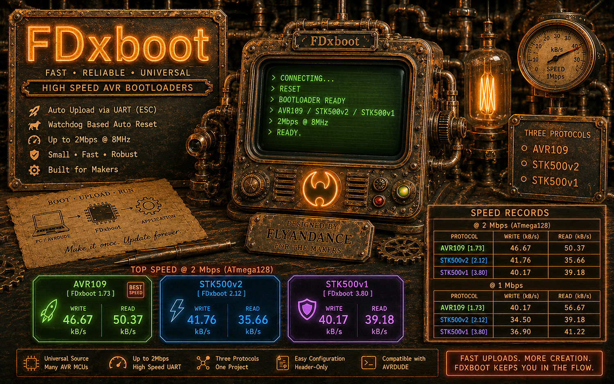
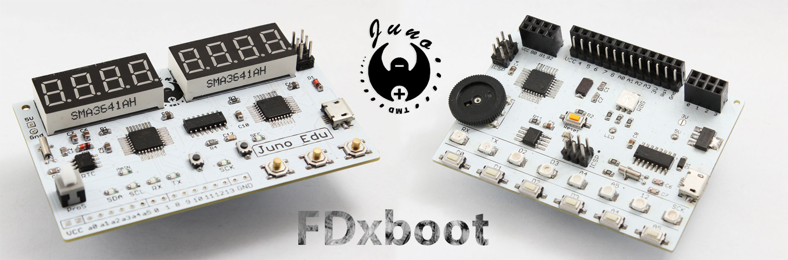
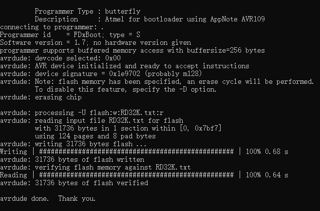
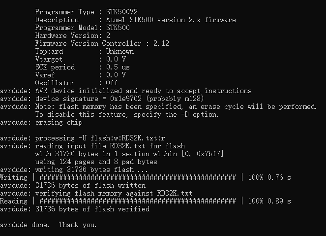
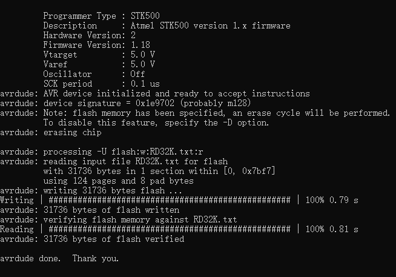

# FDxboot: High-Speed 3-in-1 Bootloaders for AVR MCUs

**FDxboot** is a family of compact, high-speed UART bootloaders for AVR MCUs. Three firmware choices are provided so the same project can be used with **AVR109**, **STK500v2**, or **STK500v1** host support. Each version is designed for fast development uploads, simple configuration, and reliable operation across common AVR Flash sizes.

<p align="center">
  
</p>

## 3 Bootloader Firmware

Size sometimes matters, depending on who you ask, but duration is more critical in my humble opinion. You want to get things done, and done quickly, so my bootloader is larger in size, but much much faster in duration. It's a trade off that you need to take. You can't have both. My bootloader are most-definitely the world's fastest in its class.


| Firmware  |  Bootloader Size | Best Use |
| :---  | :---: | :--- |
| **FDxboot 1.73 AVR109**  | 1 KiB | Highest confirmed transfer speed and smallest boot section |
| **FDxboot 2.12 STK500v2**  | 2 KiB | Packet-based host communication and STK500v2 compatibility |
| **FDxboot 3.80 STK500v1**  | 2 KiB | Simple STK500v1 compatibility with modern AVRDUDE versions |

## Top Speed Records at 2Mbps
By fast, I really mean it. These are the top recorded speeds for my 3 bootloader firmwares. AVR109 is my original hand-coded firmware; STK500v2 and v1 are derived from AVR109 using the top AI model available today. Because AVR109 is a simpler protocol, its speed is faster, while I still can fit the whole bootloader in using only 1k flash memory.

| Firmware | Test MCU | Write | Read |
| :--- | :--- | ---: | ---: |
| **FDxboot 1.7 AVR109** | ATmega128 | **46.67 kB/s** | **50.37 kB/s** |
| **FDxboot 2.12 STK500v2** | ATmega128 | **41.76 kB/s** | **35.66 kB/s** |
| **FDxboot 3.8 STK500v1** | ATmega128 | **40.17 kB/s** | **39.18 kB/s** |


## Main Features
- Three protocol choices for different host workflows
- Universal source selection for common and large-memory AVR MCUs
- Configuration kept in one header file
- Fast buffered Flash writing and verification
- Automatic startup into the application after the bootloader session
- Selectable serial speeds from 2 Mbaud down to 3,906 baud
- Compile-time baud validation and automatic UART timing-mode selection
- Optional oscillator calibration and status LEDs
- Compatible with AVRDUDE and the Z-FDxAVRC IDE-Less V1.13 workflow

<p align="center">
  
</p>

## FDxboot 1.73 AVR109



FDxboot 1.73 is the primary high-speed version. It uses AVR109 and is the best choice when minimum bootloader size and maximum transfer speed are the priorities.

The universal source supports common AVR MCUs through one configuration header. Select the MCU memory group, CPU clock, bootloader size, baud rate, oscillator calibration, and optional status LEDs without editing the main source file.

Use this version with:

```text
-c avr109 or -c butterfly
```

<br clear="left">

## FDxboot 2.12 STK500v2



FDxboot 2.12 provides the same general bootloader design with STK500v2 host communication. It is intended for users who prefer STK500v2 support while keeping the firmware compact and fast.

The normal and large-memory configurations are combined in one source package. All commonly changed settings are kept in the header file.

Use this version with:

```text
-c stk500v2
```

<br clear="left">

## FDxboot 3.80 STK500v1



FDxboot 3.80 provides STK500v1 compatibility in a universal 2 KiB build. It is a practical option when the host software or existing workflow already uses STK500v1.

It shares the same simplified configuration approach as the other universal versions, so the target MCU and serial settings can be changed from the header file.

Use this version with:

```text
-c stk500v1
```

<br clear="left">

## More Speed Results
Speeds are decimal kB/s. Results may vary with the MCU, Flash page size, baud rate, USB-to-serial adapter, operating system, and test-file size. The top advertised speed tests are done using 2Mbps with the CH340G chip. 


### 1 Mbps Speed Records

| Firmware | Test MCU | Write | Read |
| :--- | :--- | ---: | ---: |
| **FDxboot 1.7 AVR109** | ATmega16 | **22.38 kB/s** | **31.14 kB/s** |
| **FDxboot 2.10 STK500v2** | ATmega16 | **21.70 kB/s** | **25.58 kB/s** |
| **FDxboot 3.8 STK500v1** | ATmega16 | **24.70 kB/s** | **27.55 kB/s** |
| **FDxboot 1.7 AVR109** | ATmega128 | **40.17 kB/s** | **56.67 kB/s** |
| **FDxboot 2.10 STK500v2** | ATmega128 | **34.50 kB/s** | **39.18 kB/s** |
| **FDxboot 3.8 STK500v1** | ATmega128 | **36.90 kB/s** | **41.22 kB/s** |


## Basic Setup

1. Choose the protocol version that matches the AVRDUDE programmer option you plan to use.
2. Open `FDxbootREG.h` and select the MCU memory group, `F_CPU`, bootloader size, and baud-rate number.
3. Compile the bootloader for the target MCU and the correct boot-section address.
4. Program the bootloader with an external programmer.
5. Set the BOOTSZ and BOOTRST fuses to match the selected bootloader size.
6. Protect the boot section with the appropriate lock bits after testing.
7. Connect the MCU UART to a USB-to-serial adapter and upload the application with AVRDUDE.

## AVRDUDE Examples

Replace the MCU, baud rate, COM port, and filename with the values used by your hardware.

### AVR109

```text
avrdude.exe -c avr109 -p m128 -b 1000000 -P COM3 -U flash:w:"new.hex":i
```

### STK500v2

```text
avrdude.exe -c stk500v2 -p m128 -b 1000000 -P COM3 -U flash:w:"new.hex":i
```

### STK500v1

```text
avrdude.exe -c stk500v1 -p m128 -b 1000000 -P COM3 -U flash:w:"new.hex":i
```

## Reliability Notes

High serial speeds require a stable MCU clock, a solid ground connection, short UART wiring, and a reliable USB-to-serial adapter. Direct motherboard USB ports are generally preferable to busy hubs. When troubleshooting, first reduce the baud rate and verify that the firmware clock setting matches the actual MCU clock.

A successful write does not automatically confirm that the reverse UART direction is equally reliable. Verify both programming and readback when testing new hardware.

## Why FDxboot

A bootloader is used repeatedly throughout firmware development, so transfer speed and predictable behavior have a direct effect on the development cycle. FDxboot focuses on reducing upload time while keeping the source compact, configurable, and suitable for a wide range of AVR projects.

## Buy Me a Coffee

[](https://paypal.me/flyandance?country.x=US&locale.x=en_US)
